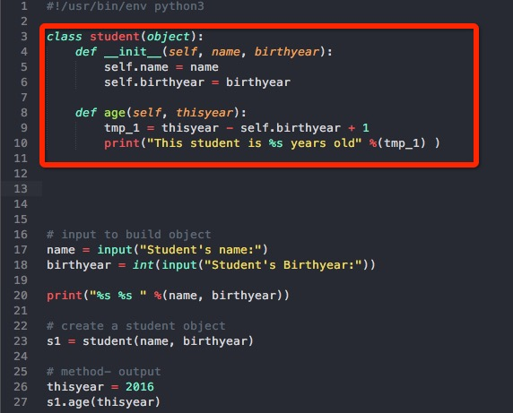

# Python 学习 面向对象(二)
因为直接来面向对象了，所以很多函数式编程的高级特性是没有涉及的
但是，感觉Python真的是涉及了很多高级程序设计的思想在里面

## 面向对象编程
	 程序执行就是消息在对象之间的传递;
	 所有数据类型&自定义的，都可以视为对象（先想哪些是对象，再看哪些是类）;
	 数据封装&继承&多态 是 三大特点;
	一个例子:



	注意：
		1. 主要是类的定义 student(object)  
		2. def __init__(self, ...): 

* 类和实例
	* `student(object)` 表示student 从object类继承下来，一般就用object
	* 可以自由地给一个实例赋予一些属性（没有属性定义这一说）
	* 所以`__init__()` 方法实际就是“定义”一个这类实例必须有的几个属性  
	* 注意第一个参数`self` （感觉这部分是因为很多没有看）
	* `数据封装` 指一个类的对象的数据和处理数据的方法都被封装了（不可见） 

* 访问限制
	* 私有变量: `self.__name = ...` 这样外部就不能再直接访问了
		* 但是还是可以通过调用实例的方法来访问，修改的
		```
			def get_name(self):
			return self.__name
		``` 
* 继承和多态
	* 继承: 类似的概念 `class bachelor(student):`
	* 继承 & 动态语言 导致 Python像是一个 “feel like an object” 语言
	* 我发现 `__init(self)__` 在子类中也是需要重写的！

* 获取对象信息
	* 有很多能判断一个对象是什么类型，有哪些属性等的内部函数
	* type() isinstance() dir() 等
	[对象信息获取函数](http://www.liaoxuefeng.com/wiki/0014316089557264a6b348958f449949df42a6d3a2e542c000/001431866385235335917b66049448ab14a499afd5b24db000)
* 实例属性 和 类属性  
	* 除了示例有属性，也能有和示例无关的类属性(直接bachelor.description访问)
	* 但是如果给实例赋了一个同名的变量，则自动覆盖（可以`del s1.description` 删除赋值）
	* 所有这些的属性都是可以自由赋值的（包括赋方法）
	eg 
	```
	class bachelor(student):
		description ="bachelor means an univervisity of college"
	```

## 高级编程 

* `__slots__`
	* 给object或class动态添加methods
	eg
	```
		from types import MethodType

		def f_author(self):
			print("Author: Kan")


		int_1.get_author = MethodType(f_author, int_1)
		int_1.get_author()

	```
	注意这个MethodType;
	给一个实例绑定的方法，对另一个实例是没有定义的
	
	* 给类绑定一个方法
	直接写好，然后 `py.print_author = author` 
	但是我发现，这个author中不能有self参数了（理论上应该也是，但是没看到规定）

	* `__slots__` 定义了这个类的实例最多被赋予哪些变量
	eg.
	```
		class py(object):
			__slots__ = ("description", "print_author")
	```
	我发现这个对与method也有限制
	这个定义的，对子类不影响；如果子类也定义了__slots__,那么限制集就是父子类限制之并


* `@property`
	* 动态语言，要经常进行参数检查
	* normal method 就是按 `set_version(1.0)` `get_version()` 来做
		* 学了一个`raise` 报错
		`if not isinstance(ver_in, float): 
				raise ValueError("Not an number")`
		
		* 但是这个做法有点复杂
	
	* @property 
		* 本质就是Python的这样一个扩展：
		在正常set和get函数前面加上@property之后， 对这个实例访问的时候，就直接当成属性，不用严格的函数调用访问某个属性了
		* eg.
		定义的时候：
		```
		#get_version
		@property 
		def version(self):
			return self.__version
		# set_version 

		@version.setter
		def version(self, ver_in):
			# judge
			## set
		
		```
		设置/访问属性的时候：
		```
		int_1.version = 1.2
		print("Intepreter Version: %s" %(int_1.version) )  
		``` 

		* 如果不定义setter，那么就规定为了只读参数

* 多重继承
类的继承一定程度上表示类的细分，但是如果一切都细分，那么会变得异常复杂
采用多重继承： 一个子类继承多个父类而来，从而可获得更多的属性细分
	* MixIn 设计模式，通常将非主要分类，只是为了标示某种特性的类，命名为MixIn
	* eg 
	```
		class panda(animal, runnableMixIn):
	```

* 定制类
通过一些参数定义类的一些特性，有点多，并且我不太知道运用的场景是啥？

* 枚举类
真正的枚举类型，而非变量了
[枚举类](http://www.liaoxuefeng.com/wiki/0014316089557264a6b348958f449949df42a6d3a2e542c000/00143191235886950998592cd3e426e91687cdae696e64b000)

* 元类
动态创建类，type(), metaclass()等内容


## Reference
1. [liaoxuefeng的博客](http://www.liaoxuefeng.com/wiki/0014316089557264a6b348958f449949df42a6d3a2e542c000/0014318645694388f1f10473d7f416e9291616be8367ab5000)
2. [动态添加methods](http://igorsobreira.com/2011/02/06/adding-methods-dynamically-in-python.html)