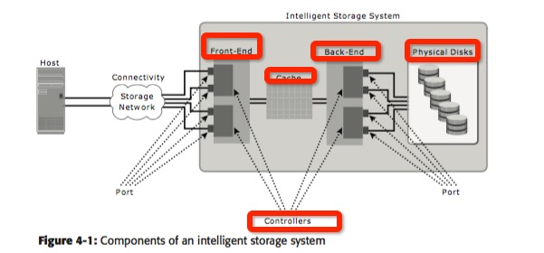
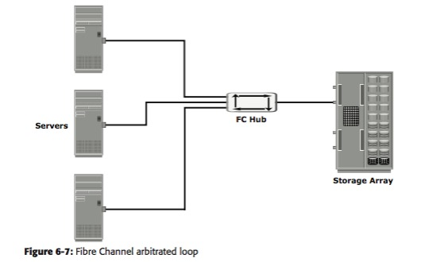
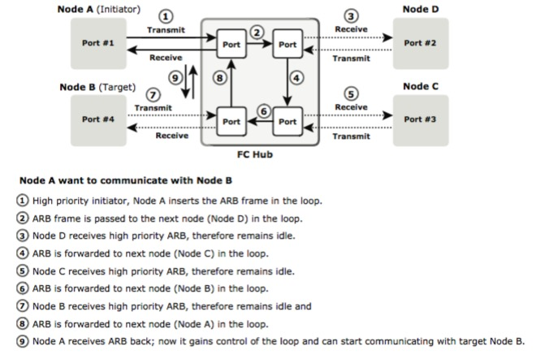
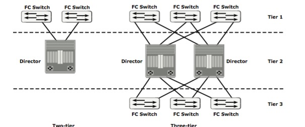
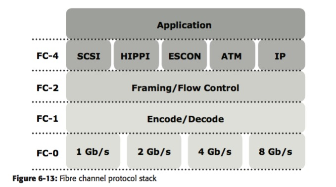
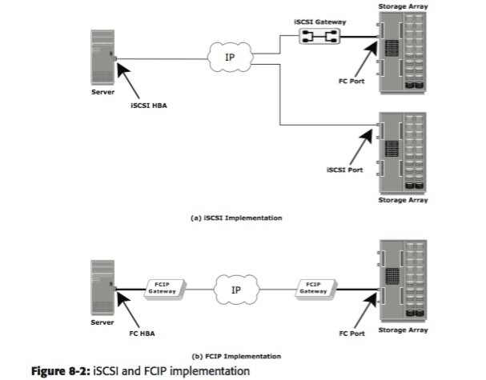

# Storage学习(一)  入门 
这篇Blog的目的就是大致的了解一下Storage会做一些什么东西，但是其实你能做的research和这个领域涉及什么似乎没有太直接的关系。

本次主要对***Information Storage & Management*** 这本书进行了学习 
## 大纲
（本次看的，将加粗标出）

* Section I: 存储系统 
	* ***Introduction***
		* 存储&历史;  Data Center; Challenges
	* Storage System 
		* Components; Disk Drive Components; Disk Drive 性能; 基本原则; Host 的组成部分
	* 数据保护: RAID
		* RAID & Components; RAID 分级; 比较; RAID 的影响
	* ***智能存储系统***
		* Components; 智能存储阵列; 一个实例
* ***Section II: 存储网络技术 & 虚拟化***
	* Direct-Attached Storage & SCSI 
	* Storage Area Networks （SAN）
	* Network-Attached Storage 
	* IP SAN
	* Content-Addressed Storage
	* Storage Virtualization 
* ***Section III: Business Continuity*** 
	* What is Business Continuity 
	* Backup & Recovery
	* Local Replication
	* Remote Replication
* Section IV: 存储安全 & 管理
	* 存储设施 安全 
	* 管理存储 基础设施
##

## Introduction 
### 存储发展
* RAID 
* DAS(Direct-Attached Storage) 直接接在Cluster中的storage 
* SAN(Storage Area Network) 基于Fibre Channel来交互，仍然是在Cluster中 
* NAS(Network-Attached Storage) 通过网络提供 File serving 
* IP-SAN将SAN放到了远端

### Data Center
* 几大组成元素
	* 应用、 Database、Server and OS、 网络、 存储阵ß列
* data center 中 storage system的requirements:
	* availability 随时可访存 
	* security 
	* scalability: storage grow with business grow  
	* performance: 性能
	* data integrity: 严格的读写规则控制？
	* capacity: 当存储的data变大，需要在同时不影响availability的前提下，提供更大的capacity
	* Managebility: 更多的自动化操作
* 管理storage infrastructure的主要任务
	* 需要能monitor整个system
	* Reporting 相应的performance cost等 
	* 提供capacity等    这几点没有一个具象的概念是应该做些什么 
* Manage information 的挑战：
	* 规模太大（为了确保可靠性又得depulicity）
	* 实时提供给计算 
	* 一个信息的价值是随时在变的
* information lifecycle: 
	* info的价值是有变化的, 根据价值变化不同的存储
	* 有一些工作可以做, ongoing
 
### storage System
* Components  
host, storage以及他们之间的connectivity
	* host 上有 HBA 与 storage相连 (cpu通过bus和HBA相连)
	* connection: bus(常用协议有PCI,IDE,SCSI等)
	* storage: 
* Disk drive (略)
	* Disk drive 的performance
* Host    (***这一段其实没怎么看懂***)
OS; drivers; Volume Manager; File system; App 
	* volume manager 是 file system和 disk drive之间optional的一层

		可以virtualization hard drives，也可以分区，每个分区用不同格式

	* File system
	不同的组织目录，文件的格式，eg FAT32,EXT2/3等
		* 主要目的是什么？ 
		* 主要做了什么？ 
			* 有block，是最小的分配给data的一块
			* 从 file -> LVM -> Hard disks 的一个分层的过程
			* journal system 可恢复

### 数据保护: 引入RAID
以disk set取代一整块的storage

* RAID 实现
	* 软件
		OS级实现
	* 硬件
		硬件控制器，要负责data regeneration 

* RAID Array的组成
HDD&controller 

* RAID 分级
分级是由这个system使用了striping, mirroring和parity各技术来定义的
	* striping
	一个stripe是分布在不同HDD上的一个横切  能improve I/O
	strip 是一个disk上的连续寻址的单元   
	* mirroring
	copy但实时同步，不同于 backup
	优点： 快速恢复
	缺点：对storage capacity要求高，另外，对write performance 也有影响
	* parity 
	对于striped disks，使用类似校验位的存储（一般是），及时恢复一个stripe中某一位的错误
	
	其中，每列表示一个disk，

	一个各级RAID介绍的总的图：
	
	
	* RAID 0  特点，利用stripe把I/O提上去了
	* RAID 1 利用mirroring，把故障修复加进去了
	* Nested RAID 
		
		* RAID 0+1
		* RAID 1+0 有区别的，虽然我还没太弄懂
		* 一个是先mirror，然后再分别stripe； 一个是先stripe，然后再对应的每block mirror
	
	* RAID 3  用了parity的技术，但是一大特点是一个stripe必须同时更新（适合large volumes data store） 
	* RAID 4 
	和RAID 3 类似，但是支持了stripe内单个block的修改 	
	* RAID 5 
	和RAID 4 类似，但是, parity blocks 可以不放在一个特定的HDD中了，可以分布在各HDD中
	* RAID 6
	用了两位parity，可以恢复两位错了

* 不同RAID 之间的比较 

* RAID 对 disk performance的影响
	* mirror 和 parity 会有 write penalty (parity 也有read penalty)
	* 选择disk 需要考虑RAID类型&host可能的读写比
* Hot Spares 
对于fail的drive, 根据不同的SSD，以及不同的策略，备份到Hot spare drive中的策略，flow也是有区别的

* 总结： 
SSD是基础，下一代是intelligent storage systems

### Intelligent Storage System
单纯把hard disk 作为storage，它的performance bottleneck了. 引入cache和management机制.

* components （4）
一张综述的图：

	* front-end 
		* port 支持不同的transport protocols like SCSI. 
		* command queuing 
			重排read commands, 减少drive头的移动（可以同时执行）, 有一些算法(seek time 最优等)
	* cache
		* cache一般以page为单位存，还有Tag RAM，存储脏位等
		* 除了正常的cache hit or miss 还会有pre-fetch, read-ahead 等（当一群read是sequential的时候）
		* write的时候，可以有write-back or write-through 也可能不写入cache（例如很大的块）
		* cache中数据如果断电可能会没有commit，所以可以mirroring或vaulting保护
		vaulting 表示system断电之后由电池供电，将cache内容写到vault disk中（因为电量可能支持不到写入到正确的disk中）
	* Back End  和RAID 打交道了
	* Physical Disk
		* SSD很好（且可以通过controllers实现为virtual HDD）
		* logical unit(volume)
			* 有点multi-tenant的意思，一个storage划分成LUN给不同host用
			* 然后，一个host可访问的LNUs在front-end的时候进行过滤
* Intelligent Storage Array   (除了active,passive 没弄懂什么区别????？)
	* High-end storage systems 
	* Midrange storage systems

* EMC 实践
具体还是不太清楚做了些什么； 但是只感觉到reliability等特性十分重要，就是玩这些特性
DMA(direct matrix architecture) 架构
然后还可以

## Introduction to 存储网络 & 虚拟化
### DAS
localization 的storage架构，仍然还是有用的，主要讲了 SCSI
感觉storage需要关注的除了架构，还有interfaces

* 类型
internal/external 直观上看是直接连到bus上，还是通过fibre链接;
scale不好，另外受一些因素的影响比较严重

* Disk Drive Interfaces
	* host 和 storage device 如何沟通；	
	* 有IDE/ATA, SATA, Parallel SCSI等
* Parallel SCSI(没有具体怎么学)   但是也是SAN等的基础  
	* SCSI 经历了一个发展的历程
	* SCSI-3 Architecture （initiator和target之间）
		command protocol, transport layer protocol(devices之间如何communicate??); Pyshical layer interconnects（其实是一个分层的协议，但是还不太知道怎么工作的！）
		还有一个典型的client-sercer model;
	* SCSI Ports
	* SCSI 不同unit 寻址

* SCSI 命令model 
	* 以CDB的格式传输命令
	* CDB中有Operation Code 感觉像操作命令？ 
	* CDB 最后有 Control Field

### SAN(Storage Area Networks)
Data Center Storage需求： 1) 随时可访存； 2) 能和一般任务集成 3） scaliability
SAN 感觉像是集中管理的分布式storage而已，devices之间用FC连接，然后访问storage array（scalability十分的好） 感觉就是storage和可能访存（网络远端用特殊设备support）的device之间构成的高速LAN

* Fibre Channel 
	连接各hosts，协议发展，具体的参数还没什么概念
* SAN Evolution 
	* SAN 像是一个switch，组织了distributed hosts和distributed storage之间的communications
	* switch 技术以及 基于IP的iSCSI和FCIP的发展
* SAN的组成成分
	* node ports （各类devices）  
	全双工  收/发
	* cabling 
	copper好处在于抗noise，而optical fiber好处在于快
	optical fiber 有多模和单模之分（物理上的）
	* 交换设备 like switches 
	还有directors(更多的port额容错能力 than switches)
	* storage arrays 
	* SAN 管理软件
	对整个SAN环境提供一个集中式的管理
 * FC Connectivity  (这是在讲SAN中的物理层<>链路层协议 FCP了)
 	* p2p
 	* FC arbitrated loop
 		* 各device之间连成loop； 一个时间，通过仲裁，只能一个device连接 storage array
 		
 		仲裁的方法：(很巧妙)
 		
 	* FC switched fabric
 		* tier 的概念 不太清楚？？？ 
 		
 		* 感觉就是 switch，目前还说不出区别？？？ 

 * FC ports 
 	有各种ports 似乎是为了支持不同的FC connectivity? 
 * FC architecture
 	* FCP 实现了remote devices作为host的一部分操作
 	* 一些名词完全看不懂了，但是architecture 应该是一个 layered 的通讯协议栈
 	* FC protocol stack
 		
 		* F4 application 可通过哪些protocol 抽象使用 FC协议栈
 		* F2 有点像链路层协议
 	* FC 寻址 （类似IP）
 		* addressing 和 ports的类型有关
 		* FC中应该是也有Name Server/ Login Server 这样的东西
 		* 每个 device 还被赋予了一个 world wide name   有点像MAC地址
 	* FC frame  （transport层的包）
 		* frame 里面也有CRC码
 	* FC data 
 		* 分成frame 进行传输
 	* Flow control （port2port之间的传输控制）
 		* BB_Credit (buffer)  使用buffer控制待传输的frames
 		* EE_Credit (end) 局限于两种特殊传输？
 	* classes of services
 		为了满足不同的传输需求，提供了不同版本的（应该是传输层）协议
 * Zoning 
 	* nodes 被分为一些groups，group内nodes能互相communicate，这样一个group就叫zone
 	* zone 有类型
 	* 还是没闹清 ports nodes 有什么区别？  ports 实在switch上的ports? 
 	* zoning 和 LUN 一起实现server 对storage的访问控制
 * FC login types   log on to the fabric 
 	* 建立两个ports之间的连接？  使用什么frame，什么个握手机制
 * FC topologies 
 topology to connect devices
 	* core-edge    popular 
 		* edge tier  就是各种switch  （所有hosts 连向上面的ports, 然后再互相连接）
 		* core tier 也是switches，但是所有的storage 连向core edge
 		* core/ edge switches 互联
 			* 访问任何storage，只需一跳？？？ 
 			* 好变动各种switch scalability 
 	* Mesh
 		* 指的是各switch 互相连接（full mesh） 或部分连接（partial mesh）
 * EMC 实例 
 * 总结：   SAN架构，FC是它的主干

### Network-Attached Storage
局域网中，用于基于IP分享file的设备！ 特点是： 特定设备(优化支持I/O的OS)/ 快速共享
基于TCP/IP 以及一些文件传输协议eg. NFS,CIFS,FTP （有点像局域网中的shared storage了）

* 和General-Purpose Server 的对比
	对storing, retrieving, accessing files 有了优化； network中的server就不再需要因fiel accessing带来的bottleneck了
* NAS File I/O
所有的I/O都是 file-level 的，只需要提供file标识，在NAS中转成对应的block访问
	* File System 
	例子还需要看一个，我认为
		* file system accessing 
		1. mount   建立一个link between file S and OS 
		2. 所有的file 以 树结构组织，存在leaf 
		3. 同时访问一个file 有保护机制  
		4. Distributed File system 和 FTP, NFS这些一起实现remote file accessing(从server 到 storage array)  
* NAS 的components
	NAS head负责网络接口支持，然后hold 特殊的访存OS等
	Storage Array 则只负责存储 
* NAS Implementations
	* Integrated NAS 
		一个head 一个 array 就封装成一个 NAS    
	* Gateway NAS 
		NAS head 和 storage arrays 分开，中间可任意搭配 
	* Integrated NAS Connectivity 
	* Gateway NAS Connectivity 
		NAS一般是嵌到SAN中的
		NAS head 更像是远端访问（IP）在SAN中的一个代理

* NAS File-Sharing Protocols
	讲NFS CIFS 远端host如何远程访问storage
	* NFS
		先mount  UDP or TCP网络连接， 然后RCP网络连接
	* CIFS
		似乎锁也很重要
* NAS I/O 操作
	* 过程： host 将file access命令包进TCP/IP -> 发给NAS head -> 理解成block access 访存 -> 得到结果 -> 处理成file的，然后再发回
	* host 有几个操作，操作file system
* 影响NAS 的因素
network latency 是一个很大的影响因素了
还有很多的影响因素，使用VLAN等可以改善
还有directory services server？  这是什么东西？   link aggregation 
* EMC Celerra 的例子 
* Summary SAN 和 NAS 是会收敛到一起的
随着performance, management, file sharing 提升，networking和storage的综合考虑越来越多

### IP-SAN 
成熟的一个解决方案  SAN block I/O NAS file I/O 
所以应该就是  IP based SAN 
两种实现方案 iSCSI/ FCIP 

* iSCSI
	需要host端有iSCSI HBA，然后和FC SAN中的 iSCSI Gateway通信，由这个Gateway进行 IP packets -> SCSI I/O的转换
	* Host端采用general NIC会需要占用CPU，用HBA比较好
	* Topo: 可以完全基于IP（都是端口来转化），或者需要bridge来进行IP，FC的转换
	* 协议栈： SCSI->iSCSI->TCP...
	* iSCSI discovery  有一个iSNS server 负责registration和回答query
	* iSCSI names
	* 每个iSCSI的交互以 PDU为基础（PDU可以被拆到不同packets）
	* 一系列确保iSCSI PDUs 重排的措施
	* SCSI还有错误恢复机制
* FCIP
	* 远距离的FC 互联起来  IP支持 FC block data 的传输（tunneling）
	* 有FCIP gateway 支持tunneling
* Summary  就感觉 IP SAN还是使得distributed SAN能够统一

### Content-Addressed Storage
有一类data长期被使用但是fixed content，如何管理这种data CAS
data和它的attributes 分开存储。 总的感觉可以减少 存储相同data的份数？ 
* Fixed Content and Archives   没太看懂 不同数据应该被怎样不同对待  archives??? 
一个 content 被 archive多次？   
* CAS 好处？   
	* content authenticity？？  什么意思？？？ hash 
	* content integrity  content 不会被修改 什么时机 check integrity？ 
	* location independence  一个 application查询data根据identifier？ 
	* SiS 同一个内容的 object 只存一次，后面的只被赋予pointer 
	* Retention Enforcement data object 还有meta-object 存储object的各种信息
	* CAS 中每个 object 都被backed up
	* 剩下两个 不知道是什么？？？ 
* 所以核心是 CAS 到底是什么？   原来的object都是按照location去在system中寻找他们，而现在试图抽象成，使用cotent相关的identifier就能定位这个object 存在哪里（是一个老技术）
[WikiPedia](https://en.wikipedia.org/wiki/Content-addressable_storage)

## Introduction to Business Continuity 

## Conclusion 

## Reference
[1] Information Storage & Management.pdf