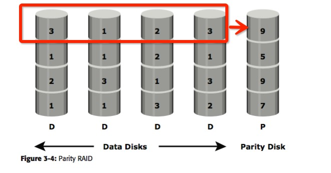

# Storage学习(一)  入门 
这篇Blog的目的就是大致的了解一下Storage会做一些什么东西，但是其实你能做的research和这个领域涉及什么似乎没有太直接的关系。

本次主要对***Information Storage & Management*** 这本书进行了学习 
## 大纲
（本次看的，将加粗标出）

* Section I: 存储系统 
	* ***Introduction***
		* 存储&历史;  Data Center; Challenges
	* Storage System 
		* Components; Disk Drive Components; Disk Drive 性能; 基本原则; Host 的组成部分
	* 数据保护: RAID
		* RAID & Components; RAID 分级; 比较; RAID 的影响
	* ***智能存储系统***
		* Components; 智能存储阵列; 一个实例
* ***Section II: 存储网络技术 & 虚拟化***
	* Direct-Attached Storage & SCSI 
	* Storage Area Networks （SAN）
	* Network-Attached Storage 
	* IP SAN
	* Content-Addressed Storage
	* Storage Virtualization 
* ***Section III: Business Continuity*** 
	* What is Business Continuity 
	* Backup & Recovery
	* Local Replication
	* Remote Replication
* Section IV: 存储安全 & 管理
	* 存储设施 安全 
	* 管理存储 基础设施
##

## Introduction 
### 存储发展
* RAID 
* DAS(Direct-Attached Storage) 直接接在Cluster中的storage 
* SAN(Storage Area Network) 基于Fibre Channel来交互，仍然是在Cluster中 
* NAS(Network-Attached Storage) 通过网络提供 File serving 
* IP-SAN将SAN放到了远端

### Data Center
* 几大组成元素
	* 应用、 Database、Server and OS、 网络、 存储阵ß列
* data center 中 storage system的requirements:
	* availability 随时可访存 
	* security 
	* scalability: storage grow with business grow  
	* performance: 性能
	* data integrity: 严格的读写规则控制？
	* capacity: 当存储的data变大，需要在同时不影响availability的前提下，提供更大的capacity
	* Managebility: 更多的自动化操作
* 管理storage infrastructure的主要任务
	* 需要能monitor整个system
	* Reporting 相应的performance cost等 
	* 提供capacity等    这几点没有一个具象的概念是应该做些什么 
* Manage information 的挑战：
	* 规模太大（为了确保可靠性又得depulicity）
	* 实时提供给计算 
	* 一个信息的价值是随时在变的
* information lifecycle: 
	* info的价值是有变化的, 根据价值变化不同的存储
	* 有一些工作可以做, ongoing
 
### storage System
* Components  
host, storage以及他们之间的connectivity
	* host 上有 HBA 与 storage相连 (cpu通过bus和HBA相连)
	* connection: bus(常用协议有PCI,IDE,SCSI等)
	* storage: 
* Disk drive (略)
	* Disk drive 的performance
* Host    (***这一段其实没怎么看懂***)
OS; drivers; Volume Manager; File system; App 
	* volume manager 是 file system和 disk drive之间optional的一层

		可以virtualization hard drives，也可以分区，每个分区用不同格式

	* File system
	不同的组织目录，文件的格式，eg FAT32,EXT2/3等
		* 主要目的是什么？ 
		* 主要做了什么？ 
			* 有block，是最小的分配给data的一块
			* 从 file -> LVM -> Hard disks 的一个分层的过程
			* journal system 可恢复

### 数据保护: 引入RAID
以disk set取代一整块的storage

* RAID 实现
	* 软件
		OS级实现
	* 硬件
		硬件控制器，要负责data regeneration 

* RAID Array的组成
HDD&controller 

* RAID 分级
分级是由这个system使用了striping, mirroring和parity各技术来定义的
	* striping
	一个stripe是分布在不同HDD上的一个横切  能improve I/O
	strip 是一个disk上的连续寻址的单元   
	* mirroring
	copy但实时同步，不同于 backup
	优点： 快速恢复
	缺点：对storage capacity要求高，另外，对write performance 也有影响
	* parity 
	对于striped disks，使用类似校验位的存储（一般是），及时恢复一个stripe中某一位的错误
	
	其中，每列表示一个disk，

	一个各级RAID介绍的总的图：
	
	
	* RAID 0  特点，利用stripe把I/O提上去了
	* RAID 1 利用mirroring，把故障修复加进去了
	* Nested RAID 
		
		* RAID 0+1
		* RAID 1+0 有区别的，虽然我还没太弄懂
		* 一个是先mirror，然后再分别stripe； 一个是先stripe，然后再对应的每block mirror
	
	* RAID 3  用了parity的技术，但是一大特点是一个stripe必须同时更新（适合large volumes data store） 
	* RAID 4 
	和RAID 3 类似，但是支持了stripe内单个block的修改 	
	* RAID 5 
	和RAID 4 类似，但是, parity blocks 可以不放在一个特定的HDD中了，可以分布在各HDD中
	* RAID 6
	用了两位parity，可以恢复两位错了

* 不同RAID 之间的比较 

* RAID 对 disk performance的影响

## Introduction to 存储网络 & 虚拟化

## Introduction to Business Continuity 

## Conclusion 

## Reference
[1] Information Storage & Management.pdf