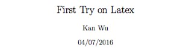
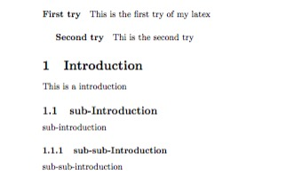
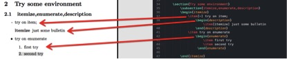
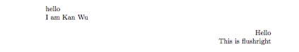
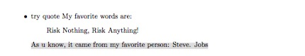

# Latex 入门 for paper writing
本Blog主要讲述**What is Latex** & **一些Latex的基本框架**

## Latex 安装
这部分应该是要写的（OS X）环境，但是由于之前没有完整记录。。。
主要涉及:

* Sublime text 插件
* OS X 下关联 Skim pdf预览器等

## 第一个文档:

1. 大致框架
``` 
\documentclass{article}

\begin{document}
	hello world! 
\end{document}
```
2. 增加标题等


```
\documentclass{article}
	\author{Kan Wu}
	\date{04/07/2016}
	\title{First Try on Latex}

\begin{document}
	\maketitle     %它在起作用	 

	hello World
\end{document}
```
3. section&paragraph

```
	\paragraph{First try}              % Paragraph效果
	This is the first try of my latex
		\subparagraph{Second try}
		Thi is the second try

	\section{Introduction}             % Section 鲜果      
	This is a introduction 
		\subsection{sub-Introduction} 
		sub-introduction
			\subsubsection{sub-sub-Introduction} 
			sub-sub-introduction
```

## Latex 文档的基本结构 
* Tex&Latex
	* Tex 是Donald Knuth 写的排版引擎
	* LaTex 是Lesile Lamport 基于Tex引擎写的一个宏包  
* Latex,Tex到底是扮演了什么角色
	* **作者、图书设计者、出版者**
	我们是作者，组织文字逻辑结构; 编写Latex程序则是使用Latex库对整个版面进行设计，增强可读性;最后出版者则是Tex引擎，真正生成Pdf 
	* 版面设计 Latex美学，better可读性
	* 优势 更漂亮，且可扩展包很强大
* Latex 文件一些小说明 
文档 + 使用Latex宏包的命令来排版
	* 空白距离
		* 空格、Tab表示空格； 空行表示换段
		* 多个连续的空格或空行均表示一个
	* 保留字符
	 # $ % ^ & _ { } ~ \ 
 	 前面加 `\` 来转义输出
	* Latex 命令
	`\命令`
		* {} 可以接在所有的命令后面（由于latex命令忽略后面的空格，所以可以加一个{}再接一个空格）
		* 有的命令之后会接参数 `\命令[可选参数]{参数}`
	* 注释
	% 会注释掉这行%后面的内容，包括换行符
* 源文件的结构 
``` 
\documentclass{}   % 打头,指明文档的类型

\usepackage{}      % 引用新的宏包，就是加入可调用的一些有用的排版命令

\begin{document}   % 开始文档正文

\end{document}     % 结束文档正文

```
* 命令行的执行过程 
	1. 编写.tex文件 
	2. 编译得.dvi文件
	3. 显示.dvi文件 
* 文档布局
	* 文档类  `\documentclass[options]{class}` 例如article类，然后可设字体大小等
	* 宏包 `\usepackage[options]{package}` 使用一些高级的命令绘图等
	* 页面样式 `\pagestyle{style} \thispagestyle{style}` 就是设置页眉页脚风格的
* 各类latex文件 如.tex等
.tex 源文件; .sty 宏包文件(相关的还有.dtx .ins) 
.cls 定义文档布局的模板文件（可用`/documentclass{包含}`）
.fd 字体文件

* ***大型工程*** 
大型文件最好把文档分割成多个部分来完成！ 
1. `\include{filename.tex}` 另起一页加入.tex中的内容(这个.tex格式是否有一些要求？)
2. `\includeonly{file1,file2,file3,...}` 在导言区加入，目前还不知道具体的用途
3. `syntonly` 可以进行拼写检查
4. `\import{intro}` 即可将intro.tex内容导入到相应位置，intro.tex就不用是完整的latex源文件格式了
### 杂
* `/maketitle` 生成标头
* `/tableofcontents` 就是生成目录
* `\\` 强迫换行; 空行换段
* `\section`
* ``

## 一些排版格式
一些逻辑格式可帮助我们理解文本

* 断行&分页  
`\\` 断行; `\newpage` 新一页; 
断词: 没怎么看，不知道怎么用（不过也绝对是为了更好的可读性）
`\mbox{abcdef}` 表示后面这个词一定会在一起显示; `\fbox{}` 相同，但是加上框来强调
* 保留的一些参数
`\today` 日期
`\Tex` `\LaTeX` 
* 特殊字符打印
	* `" "` 用 ` `` '' ` 打印
	* `' '` 用 ` ‘ ’ ` 打印
	* `- or -- or ---` 不同长度的破折号用对应个数的`-` 即可打印
	* `~` 用 `\~{}` 打印
	* `...` 用 `\ldots` 
	* 摄氏度符号 & 欧元符号 & 注音符号 没有记录
* Latex中国际语言打印 
没有进行学习
* 单词间隔
	* Latex默认在句号后加入更大的空格，增强可读性
	* 有的时候不能要，因为是缩写等；所以需要标记加以说明
* 标题、章、节
	* `\section{...}` `\part{}` `\chapter{}` `\appendix{}`
	* `\tableofcontents` 目录
	* 标题： `\maketitle`  title的内容必须在之前由`\title{}, \author{}` 等设定
	* 
* 交叉引用
就是引用在哪一节，哪一页出现了
* 脚注 `\footnote{脚注的内容}`
* 强调 `\underline{}` 下划线 `\emph{text}`斜体
* 环境 一些重要的打印格式
统一的使用格式是 
```
\begin{environment}
	... 
\end{environment}
```
	* itemize  列点  `\item[-] 文字`
	* enumerate 列数字 `\item`
	* description 定义的形式 `\item[名词] 描述`
	
	* 对齐，居中等
		* flashleft or  flashright or center
	
	* 引用
	`\quote` 做引用的样子
	
	* 摘要 abstract
	* 原文打印 verbatim 严格的逐字打印，在段落中可以直接使用\verb|text| 来打印
	* 表格 tabular 有很多参数

* 浮动体
一些图片或表格，这一页放不下了，可以排版放下一页等
* 保护脆弱命令
上两个部分的细节都没怎么看

## 数学公式
这部分，现在不准备详细学习; 而且我认为这部分也应该主要以查询用 

## 索引和参考文件的生成，以及一些包的使用
* 引用、索引，页眉页脚等
* .sty 等东西

## Latex 画图形
卧槽，Latex还能画图？ 是简单的统计图？ 
* 解析几何的图、 流程图、 
## 定制latex
* 新建命令、环境和宏包


## 总结

## 引用 
