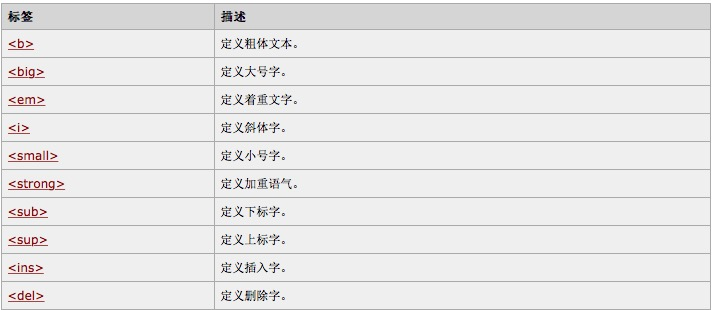
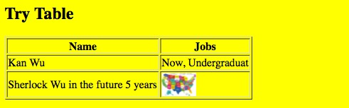
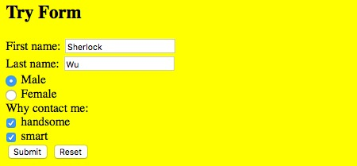
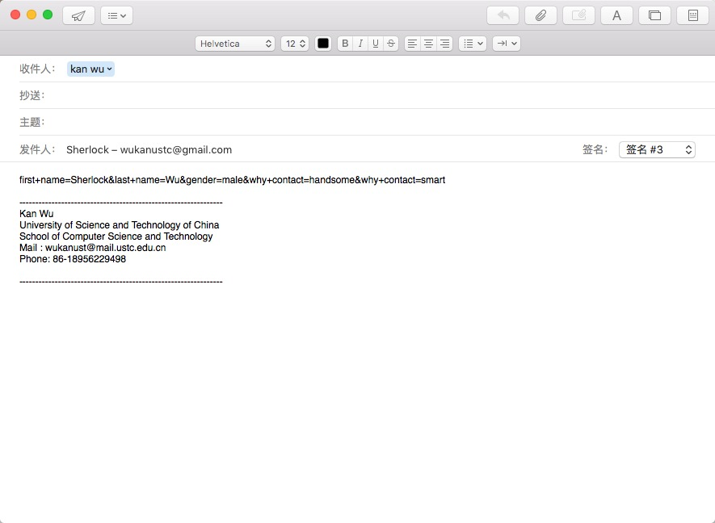

# HTML,CSS,JS 学习
写这篇Blog的目的是，系统的学习一下Web前端的从 HTML -> CSS -> JS (不会涉及的太复杂)
HTML -> XHTML（更严谨） -> HTML5（下一代HTML） -> CSS

## HTML
### 基础
#### introduction
* 由标签描述布局  < > 必须用开始，结束两个包围内容
```
	<!DOCTYPE HTML>
	<html>                                    % 网页 
		<body>	                              % 网页显示的部分
			<h1> Heading </h1>                % 标题
			<p1> This is normal writing</p1>  % 段落
		</body>
	</html>
``` 

#### 元素,属性
`<a href=""> xxxx  </a>` xxxx为标签内容（元素） href为属性
属性总是 `name="value"` 来写，标示
eg. `<h1 align="center">` `<body bgcolor="yellow">`

#### 标题&段落
```
	<hk> </hk>   % k表示不同大小的标题 
	<hr />		 % 加一条横线
	<p1> 内容 </p1> % 段落，会自动在前后添加空行; 在断中换行用上边的`<br />`

```

#### 网站布局 
可使用 `<div>` 和 `<table来布局>`
* `<div>`
与head一起定义了很多 div的格式，然后来布局
* `<table>`
注: `<span>` 是用于组织一行内的元素的 

框架： 
？？？？？？？？？？


#### 常用的一些标签
* 标题，段落，链接，图像，空（换行）
```
	<a href="http://home.ustc.edu.cn/~wukanust"> Kan's homepage </a>	
	% 链接 target="_blank" 可使得在新标签页打开
	    %注意这个的写法特殊
	<br />                              %换行
	<!-- 注释 -->
	&nbsp								%空格占位符
```
* 
* 链接的使用: 
	* 做本页内的跳转
	```
		<a href="#last"> jump to the last </a>
		...
		<a name="last"> At Last</a>   
		%在想标示的地方进行跳转
	```
* 插入图像 还有 插入地图等的，这部分没有看怎么用
* 表格 `<table>` 一行 `<tr>` 每行的每个单元格 `<td>`  td中写上单元格的内容; 标头在<tr>中用`<th>` 标识
```
	<h2> Try Table</h2>
			<table border="1">
				<tr>
					<th> Name </th>
					<th> Jobs </th>
				</tr>
				<tr>
					<td> Kan Wu </td>
					<td> Now, Undergraduat</td>
				</tr>

				<tr>
					<td> Sherlock Wu in the future 5 years</td>
					<td>  </td>
				</tr>
			</table>

```
结果: 
如果，有一个td是空的，需要用 `&nbsp` 占位 来维持格式

* bulletin 列举
	* 打点用`<ul>`; 每个项用`<li>`
	* 1，2，3 用`<ol>`
	* definition（一个名词对应一段话） 用`<dl>`做打标签，每个名词用`<dt>`,定义用`<dd>`

* 交互式表单
可用于让用户提供一些信息等
`<form>`
有文本域，单选按钮，复选框，提交按钮等
```
<form action="MAILTO:wukanustc@gmail.com" method="post">
% action 表示submit之后处理数据的东西是什么（数据也会传给它）
		<!-- Form -->
			<!--name first/ last--> 
			First name:
			<input type="text" name="first name" />
			<br />Last name: 
			<input type="text" name="last name" />
			<br />
			% 纯输入文本
	
			<!--gender-->
			<input type="radio" name="gender" value="male" /> 
			Male <br /> 
			<input type="radio" name="gender" value="female" />
			Female <br />
			% 单选项


			<!-- visit purpose -->
			Why contact me: <br />
			<input type="checkbox" name="why contact" value="handsome" />
			handsome <br />
			<input type="checkbox" name="why contact" value="smart" />
			smart <br />
			% 复选项

			<!--submit-->
			<input type="submit" value="Submit" />
			<input type="reset" value="Reset" />
			% submit reset 按钮, value 是显示的内容

		</form>

```
效果图：




#### 一些样式的使用CSS（可以应用外部样式表支持）
有三种在html文件中定义样式的方法
另: `<div>` 表示一个块 `<span>` 表示一行内的不同格式(现在没有什么显示效果，等到后面和CSS合用就能看出来,用来布局)

## CSS


## javascript

##Reference
1. [知乎的一个答案](https://www.zhihu.com/question/20003635)
2. [知乎另一个](https://www.zhihu.com/question/22646257)
3. [LXF的Blog on JS](http://www.liaoxuefeng.com/wiki/001434446689867b27157e896e74d51a89c25cc8b43bdb3000)
4. [w3school教程](http://www.w3school.com.cn)
5. [网易的一个HTML课程](http://study.163.com/course/courseMain.htm?courseId=171001)
6. [一本书](./docs/HTML.pdf)
