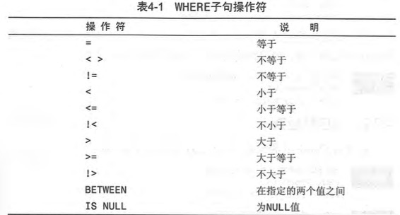
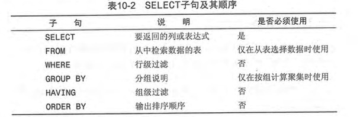
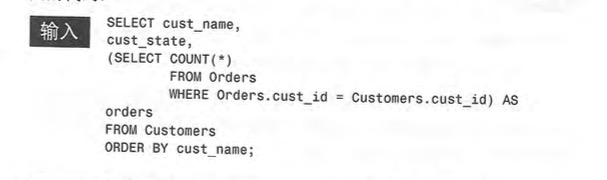

# 数据库复习
主要复习一些database的知识，plus，搭好一个database system，来进行一些尝试; 目前还是主要看那本书为主

## introduction
* 通过DBMS 访问 DB
* 表，属性之间表示一些关系
	* schema 就是描述一个表，关系&各属性取什么值，叫什么名字的 模式 
	* 每行表示一个 record 关系的实例
		* 但是每个行 应该 有一个能 唯一标识自己的 主键（primary key）eg 主语的ID等
* SQL 提供从数据库读/写的高效方法（所有DBMS都支持的）
* 

## 检索数据 
	
* 检索一个或多个列 (SQL命令的空格换行等会被忽略，最好一个语句以;结尾)

	``` 
		SELECT COlUMN
		FROM TABLES;
	```	
	其实，SELECT 出来的，不管多复杂，都是一个表
* 通配符 `*` 表示所有的列

#### 排序检索数据
* `ORDER BY` 子句
	```
		SELECT COLUMN1,C2
		FROM TABLES 
		ORDER BY COLUMN2; 
	```
* ORDER 一定要是最后一个子句 & 用未选出的列排序也可以
* 可以按多个列排序，先第一个，第一个相同再第二个
* 反序 `ORDER BY C1 DESC` 但是若是按多个列排序，则只是反序了紧邻的那个

#### 过滤数据 
* `WHERE` 子句 过滤一些**行**, 在FROM子句之后给出
* 子句中可用很多操作符 描述过滤条件
	
	eg.
	```
		SELECT Name, Last_Name, Birthday
		From Try_0413
		WHERE Birthday BETWEEN 19950101 AND 19960415
		ORDER BY Last_Name DESC;
	```
##### 高级数据过滤
* 组合WHERE 用AND/ OR 逻辑操作符连接
	* 通过不只一个列的条件过滤 AND OR  
		```
			SELECT Name, Last_Name, Birthday
			From Try_0413
			WHERE Birthday < 19950101 
				AND Hometown = "HongKong"
			ORDER BY Last_Name DESC;
		```
	* 复合AND和OR的情形， 一般DBMS会将AND按较高优先级的来结合运算，我们可以使用括号
* IN操作符
	` WHERE Hometown IN ("HongKong", "TongLing")`
	IN的功能性其实没什么特点，但是方便书写
* NOT
	取补集后面的过滤条件	

##### 用通配符过滤 （需要匹配，而不是比较了）
* LIKE操作符 + 匹配模式
	` WHERE Name LIKE "Sher%" `    %匹配任意多个字符
	`_` 匹配单个字符
	`[]` 使用 
	没怎么看，目前还是别太用的比较好

#### 数据处理 
##### 计算字段 
Table中数据需要经过处理输出（实际是又得到了一个列）

* 一些操作 
	* 拼接字段  "||"    但是MYSQL并不支持（用`CONCAT()`）
		* 拼接后表，设置别名 `AS 名字`
	* 算数计算 + - * /   div mod
	eg.
	```
	 SELECT name, (2016 - birthday div 10000 + 1) AS age  FROM student;

	+--------+------+
	| name   | age  |
	+--------+------+
	| Kan Wu |   22 |
	| Ye Li  |   23 |
	+--------+------+

	```	
	* 使用数据处理函数   有一些文本，日期和数学处理函数

* 汇总数据 (表中数据->得一个统计值)
eg 确定行数，各行求和，找最值等
	
	* AVG()  
	该列的平均值 `SELECT AVG(某列) AS FROM TABLE` 
	可以过滤出几行，再进行均值，用where即可（感觉是一步一步得到结果的）
	需要注意的是：AVG无论如何只能对一列处理

	* COUNT()
	统计该列的行数目
	`COUNT(*)` 表示统计所有行（包括NULL） `COUNT(某列)` 表示统计这行所有非NULL


	* MAX() MIN() 
	必须指定某一列
	* SUM()
	求和某列或该列的特定几行（一般用来统计总共或某供应商有多少货）

	* 这几个函数的使用：
	可以对所有行或特定一些行计算 & 对某行不一样的值处理（DISTINCT）
	eg. 求各报价的均值（不用加权，所以每个报价取一个就行）
	```
		SELECT AVG(DISTINCT GRADES) FROM student;
	```

	可能还有 TOP 函数可以学着用

* 分组数据   (这个命令真的不熟)
GROUP BY & HAVING使用； 
	* 数据分组 
	目前所有的查询都是在全表或者过滤的支持下作的；
	一种查询: 给出各厂商的供货总数（多种商品）
	* 创建分组
	eg 
	```
		SELECT name, COUNT(*) AS Numbers 
		FROM student GROUP BY GRADES;
	```

	* 过滤分组
	规定结果包含哪些分组，去除哪些分组的数据； 使用HAVING 过滤（对group之后的那几列的值进行过滤）
		* HAVING 在分组之后过滤, WHERE 第一个过滤表，然后再可能的分组操作
	eg.
	```
		SELECT GRADES, COUNT(*)    %2. 得相应的列
		FROM student 
		WHERE birthday>19940101    %1. 过滤 
		GROUP BY GRADES            %2. group
		HAVING GRADES>99;          %3. 在分组中过滤
	```
	* 分组和排序 	
	`ORDER BY` `GROUP BY`

	* SELECT 子句顺序 
	ORDER, GROUP, HAVING, WHERE 这些子句应该以什么顺序执行：
	

#### 子查询
学会将复杂的查询操作，描述成多项子查询（例如设计多个表的时候）
eg. 从student和classes（只包括上这个课的学生的名字）两个表中，查询上database课的学生的学号和成绩 
	
1. 从classes 中查到上这个课的学生的名字
	`SELECT student from classes WHERE class_name = "Database";`
结果: Kan Wu, Xiaolu Li
2. 根据这些名字在student中查出他们的信息
	`SELECT name, ID, GRADES FROM student WHERE name IN ("Kan Wu", "Xiaolu Li");`

将子查询联合起来写：

```
	SELECT name, ID, GRADES FROM student WHERE name IN (
    SELECT student from classes WHERE class_name = "Database");
```

但是也可以看出来一些局限性：
1. 子查询的结果，必须是单列
2. 性能不太好

* 作为计算字段利用子查询  (感觉之前没讲过这么写的)  但是应该是有用&有替代做法的


#### 联接表

* 联接
	* 存储信息，分裂表有利于减少信息冗余等，但是各表之间也有联接的枢纽“关系”（主键）
	* 但是分裂也为检索操作造成了一定的难度，使用join，先合并成一个大的表
* 创建联接表
	* SELECT时 使用WHERE 规定如何联接多个表（表一的一行，和表二的哪些行匹配）
	eg. 从student和classes（只包括上这个课的学生的名字）两个表中，查询上database课的学生的学号和成绩
	1. 联接  `WHERE student.name = classes.student`
	2. 在大表上进行查询 
		`SELECT student.name, student.ID, student.GRADES `
		`WHERE classes.class_name = "Database"`  
	汇总:
	```
	-> SELECT student.name, student.ID, student.GRADES 
    -> FROM student, classes
    -> WHERE (student.name = classes.student) AND (classes.class_name = "Database")
    -> ORDER BY student.GRADES;

	+-----------+------------+--------+
	| name      | ID         | GRADES |
	+-----------+------------+--------+
	| Kan Wu    | PB12011003 |     98 |
	| Xiaolu Li | PB12011087 |    100 |
	+-----------+------------+--------+
	
	```
	对于多表，联接和子查询有的功能相同

#### 高级联接

* 查询中经常出现的表，可以使用 xxx AS C 用别名方便书写
* **不同类型的联接**
不再仅仅是等值判断
	* 自连接
	* 自然连接
	* 外部链接

#### 组合查询

## 插入数据 
* 创建表
	* 需要给出 表明 & 表列名 & 表列的定义
	```
	create table ***(
		p_1 CHAR(10) NOT NULL DEFAULT xxx,
		p_2 CHAR(20) NOT NULL,
 		p_3 DECIMAL	 	
	);
	```
	* NOT NULL 表示，插入一行时，该列是否可以先不给出
	* DEFAULT 表示插入行时，若没有赋值，默认给什么值
* 更新表 
	`ALTER TABLE` 更改表的结构
	eg. 
	```
	ALTER TABLE student 
    ADD ID CHAR(10);
	```
* 删除，重命名表  `DROP TABLE student` 
* `INSERT INTO` 语句
	`INSERT INTO table(列名称...) VALUES ("", 4545, ...)`
	全部列都有的话，table后可省略
* `UPDATE` 语句
	`UPDATE 表名称 SET 列名称 = 新值 WHERE 列名称 = 某值`
	eg.
	`UPDATE student SET ID = "SA16011071" WHERE name = "Ye Li";`
* `DELETE` 语句
	`DELETE FROM 表名称 WHERE 列名称 = 值`
	eg. 
	`DELETE FROM student WHERE name = "Naughty Bo";`


## 视图

## 事务&游标

## SQL高级特性 


## Reference 
1. [w3school 的一个关于如何写SQL的教程](http://www.w3school.com.cn/sql/index.asp)
2. **有一本书:SQL必知必会**