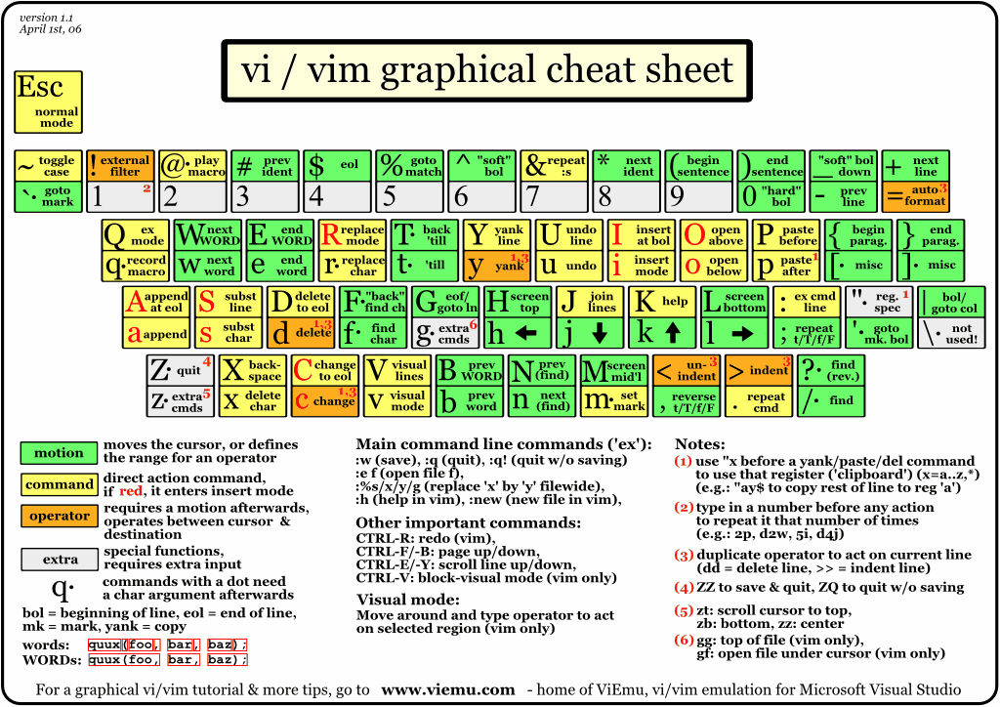

# vim 使用积累
写这个Blog的目的是，积累一些vim的使用经历，including 快捷键，便捷使用等（长期不用容易遗忘）

## vim 快捷键
搜索: `/XXX enter` 然后 `n` 下一个

## 调整字大小
？？？？

## vim 快捷键

## 配置一下vim 
* 直接使用了spf13的配置，看一下[网站](https://github.com/spf13/spf13-vim)
	* spf13 使用vundle 管理 vim插件 
	* 一个介绍的网站 [Blog](http://harrycode.logdown.com/tags/Vim)

## 如何在一个 file中 搜索相应的 functions? 
可能有用的: [1](http://easwy.com/blog/archives/advanced-vim-skills-cscope/) [2](http://my.oschina.net/shelllife/blog/120922)

## vim 新建标签页:
`:tabnew` 然后使用 `gt` 切换 [参考](http://www.webinno.cn/blog/article/view/44)	

## 光标移动 
`hjkl` 移动
`0` 移动到行首
`w` 按word移动    `b` 上一个单词  大写`W` `B` 则是按空格移动

## 使用vim 阅读二进制文件
结合 xxd 这个 hexdump软件 
1. vim 打开这个二进制文件 `vim xxx -b`
2. 在vim中输入 `:%!xxd`

## 复制/ 粘贴 [1](http://blog.csdn.net/nkguohao/article/details/8937695)

## vim 支持Markdown 
[可能有用的Tutorail](http://www.jianshu.com/p/24aefcd4ca93)

[一个blog](http://easwy.com/blog/archives/advanced-vim-skills-basic-move-method/)

