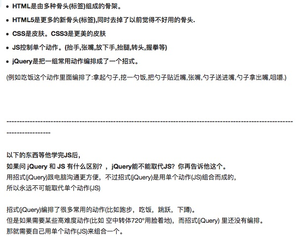

# Javascript 学习
写这篇Blog的目的，主要是学习一些基本的JS programming，然后力求写出高级的HTML web（但是，在此之前，我仍然对object-oriented不熟）

## Introduction
为了html动态效果的script语言，漏洞百出

## 基础
* 嵌入js
	* 通常把`<script>`嵌入到HTML文档的`<head>`中
	```
		<head>
			<script>
				alert("hello world")
			</script>
		</head>	
	```	
	(为啥直接就跳弹窗了呢？)

	* 也可以放在单独的.js文件中 `<script src="./js/try_1.js"> </script>` (在.js文件中直接写操作就行，不用script格式)
	* 需要学习一下如何通过 chrome 调试一些js操作
	[利用chrome debug](http://www.liaoxuefeng.com/wiki/001434446689867b27157e896e74d51a89c25cc8b43bdb3000/00143449917624134f5c4695b524e81a581ab5a222b05ec000)

* 基本语法
语法和java类似！  要加`;`，严格区分大小写
* 数据类型和变量
	* Number 整数&Float   `NaN` `Infinity` 两个特殊的
	* 字符串
	* 布尔值 
		* 相等运算符使用 `===` 不要用有缺陷的`==`
		* 另`NaN===NaN` 也不正确，NaN不等于任何值； 使用`isNaN(NaN);` 来判断
		* 
	* `null`
	* 数组： 
		* `var arr = [1,2,"Hello",null];`
		* 或是用 new Array(1,3,4);  还是建议用[]
		* `arr[0]` 访问
	* 对象：
		* 一个名字引导的对象下，有一系列的key-value对
		eg.
		```
		var Kan ={
			name : "Kan Wu",
			age : 15,
			marriage : null,
			intro : a
		};
		``` 
		注意是`:` 用 `Kan.name` 访问
	* 变量
		js是动态语言，所以应该是内存中分配内容，然后，变量存指针 

* 字符串
	* `s.length`
	* s 赋值之后不可变，对s[x] 赋值不会有任何效果
	* js 提供了一些

## 函数

## 标准对象？ 

## 面向对象编程

## 浏览器

## jQuery
jQuery 是JS 的一套lib, 有一个很好的解释js, jQuery 关系的说法: 


* `$` 应该是jQuery的一个函数，他针对不同的输入有不同的动作， (例如，用传入的string生成一个jQuery object)
* JS, jQuery 都是下载到本地, 有browser 解释执行
* DOM操作 ？  和html docs interact 
	* DOM 节点？   html文件中的某个标签，就对应一个节点
	* jQuery 取DOM节点，会对它进行包装，得到一个jQuery对象
	* DOM操作:
		* 
* `$()`
	* eg. `$("button")` 选中 `<button> </button>` 节点, `$("#box")` 选中id=box的节点
	* 


参考的文献 [一个综述的Blog](https://www.pureweber.com/article/jquery-at-a-glance/)
## underscore

## Node.js
Javascript （backend）执行的一个解释器


## Conclusion

## 问题：
* 为啥直接就跳弹窗了呢？ 


## Reference
1. [廖雪峰的Blog](http://www.liaoxuefeng.com/wiki/001434446689867b27157e896e74d51a89c25cc8b43bdb3000/00143449917624134f5c4695b524e81a581ab5a222b05ec000)