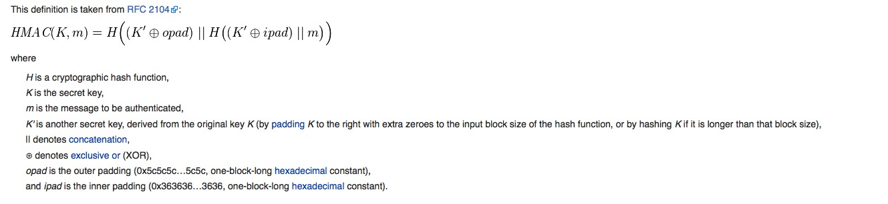

# Hash & MAC
本Blog主要记录一些Hash和MAC函数的知识
## HASH
安全性就靠他！应该是一个签名（无法逆向破解）而同样由于不可逆，也是不可能用于加密，解密的

### MD5
### SHA-1

## MAC
一种验证机制
在sender, receiver两端，对message运用相同的MAC算法，比较两次计算的值（那不能在中间把MAC也改掉么？）
在验证message integrity的同时，验证来源方

## HMAC（Hash-based MAC）
对key和message同时MAC计算
有key和两次Hash，似乎是很牢靠（并且克服了在中间修改MAC值的可能？）

## SSL
### 窃听（加密）
有窃听，使用秘钥，加密解密   DES 

### 篡改（信息摘要）
用Message Digest detect content被篡改（需要映射函数，不可逆，抗冲突）

### 仿冒（数字证书）
detect 仿冒源
和信息摘要一起工作，使用sender的私钥加密一下message digest

### 中间人攻击
交换秘钥时，在中间进行篡改

## References
1. [一个综述](http://www.cnblogs.com/songhan/archive/2012/07/29/2613898.html)
2. [HMAC, wiki](https://en.wikipedia.org/wiki/Hash-based_message_authentication_code)