# FlowVisor
主要了解一下FlowVisor的工作机制等

##network virtulization 
应该有hardware virtulization 层 
上层可以隔离开的，在自己的网络中实现自己的协议/ 底层应该可以实现对任意型号switch的操作
FlowVisor选择OpenFlow 作为抽象

介于controller 和 swtich之间   转化controller的指令， 过滤相应的switch数据，上交给特定的controller
slice（不知道什么含义？）  

## 安装open virtex 
和flowvisor 还是有点区别的 

* 我的思考： 
  应该是在mininet中间有一个open virtex？   或者他作为controller？ 然后还有一个可以设置他的接口？
  不清楚
* 需要virtualbox？  应该是他给了个配好的虚拟机？  那我不能按他那么做
* 感觉是在mininet创建了很多switches，然后 OVX 连上去
	选择安装 官方提供的 linux 虚拟机
* 在OSX 下安装了 virtual box  然后以下载的虚拟硬盘为disk新建了一个虚拟机    
	user: ovx  passwd: ovx  
* 在mininet 中有一个topo (下图为switch, 每个switch链接4个hosts)
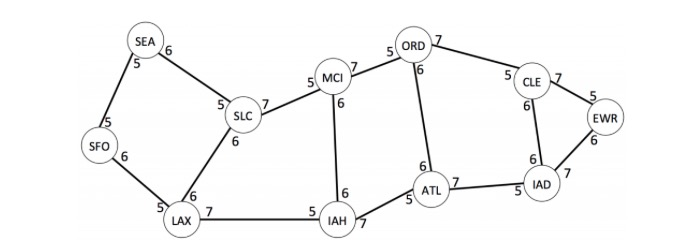 

1. 使用一个python程序配置的，还能import mininet相关的，添加了remotecontroller ，  mininet和Python好强大！ 
	注意着只是配置了物理链路，如果不配置OVX，现在我们只知道host，不知道链路的
2. 运行了.py  新开一个 terminal
3. 运行了一个 .sh  java编译了OVX     但是应该不是根据sh来连接 switch的，不知道在哪connect的
4. 创建虚拟网络  
需要创建虚拟switch，switch对于的port，hosts，以及链路   （下面尝试给tenant 1 一个SEA-SFO-LAX 然后SEA,LAX各连一个switch的虚拟网络）
	1. 创建一个controller    在localhost  `python ovxctl.py -n createNetwork tcp:localhost:10000 10.0.0.0 16`
	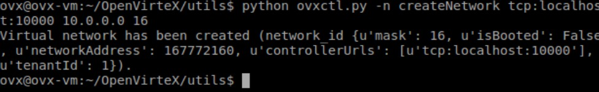
	2. 创建virtual switches （tenant ID =1 用DPID标示switch） `python ovxctl.py -n createSwitch 1 00:00:00:00:00:00:01:00`
	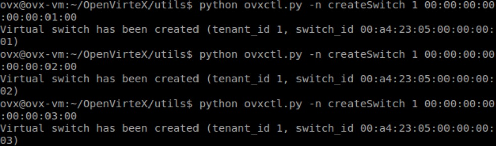
	这段话什么意思：`For the curious, the structure of the virtual DPID is as follows: first byte is 0x00, the 24-bit ON.Lab OUI (Organizationally Unique Identifier) of a4:23:05, and the final 4 bytes represent a counter (starting at 1) for the number of virtual switches per tenant` ??? 
	3. 创建 virtual ports on virtual switch (tenant ID=1, physical DPID and physical port)  `python ovxctl.py -n createPort 1 00:00:00:00:00:00:01:00 1`
	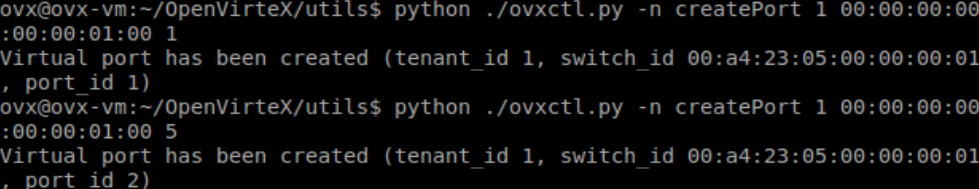
	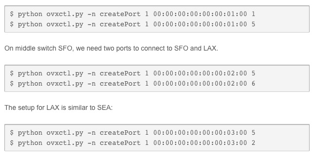
	4. 创建 virtual link（需要源switch的tenant ID, the DPID and port number, 目的switch的the DPID and port number, 还有 the routing mode, and the number of backup routes）
	virtual link 的physical 路径可以指定 manual或spf(short path) 
	用的switch id, port id 来创立的link
	`python ovxctl.py -n connectLink 1 00:a4:23:05:00:00:00:01 2 00:a4:23:05:00:00:00:02 1 spf 1`
	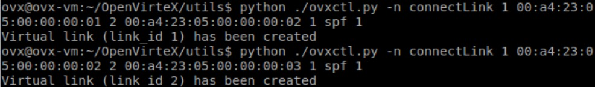
	5. 把部分端口连到 hosts （需要端口的tenant ID, virtual switch DPID, virtual switch port, 和主机的 MAC address） 
	`python ovxctl.py -n connectHost 1 00:a4:23:05:00:00:00:01 1 00:00:00:00:01:01`
	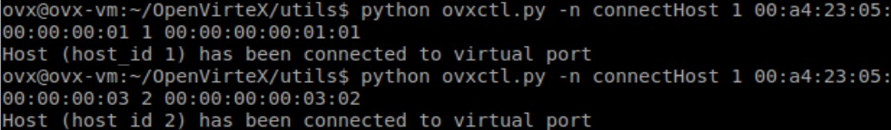
5. 启动虚拟网络
`python ovxctl.py -n startNetwork 1` 
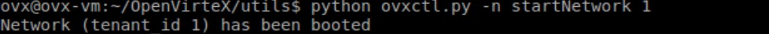
ping 实验，发现可以ping通了
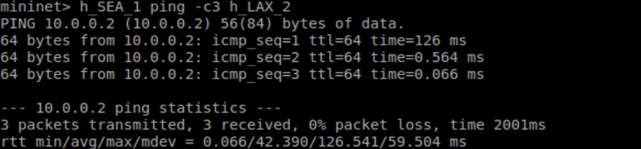

## 安装flowvisor
1. install ant `sudo apt-get install ant` （一个编译平台）
2. 安装jdk 1.6 一下版本 `sudo apt-get install openjdk-6-jdk`
3. 进入flowvisor make  `BUILD SUCCESSFUL`
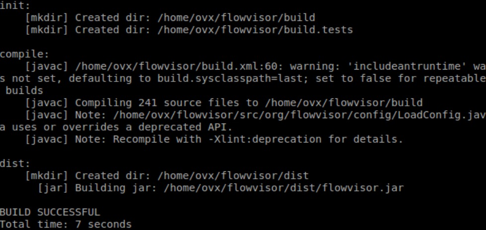
4. 在host中创建新的group, user 来管理flowvisor
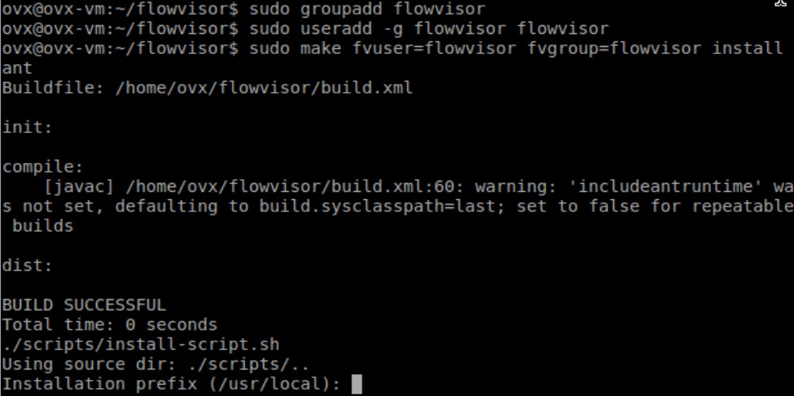
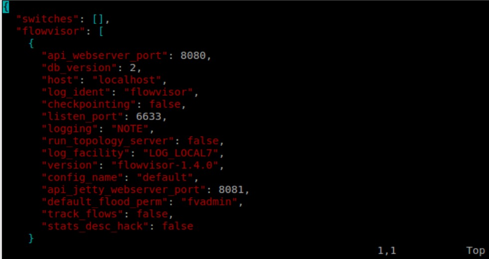
5. 以flowvisor用户启动flowvisor
`sudo -u flowvisor flowvisor`

[很好的安装说明](http://chyeh.logdown.com/posts/91944-flowvisor-installed-in-ubuntu-server-12-4-lts)

###下面进入flowvisor实验
floodlight controller? 
1. 启动floodlight controller `java –jar ./ floodlight-0.90/target/floodlight.jar`
和 flowvisor
如果同时做了ovx的实验，standard controller 由于都会占用6633端口，所以最好重启一下（虽然我认为这也不是最好的解决方法） 
2. 创建了一个topo controller设置为了flowvisor，端口是6633
`# sudo mn --controller=remote,127.0.0.1,6633`
3. 然后flowvisor 8083端口 连向 floodlight  6634 端口 
[实验教程](http://www.sdnlab.com/3081.html)
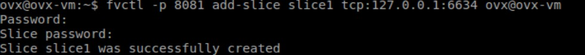
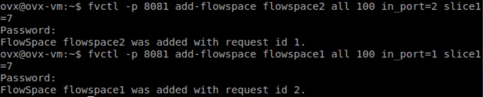

## References
[安装的链接](http://ovx.onlab.us/getting-started/installation/)
[tutorial的链接](http://ovx.onlab.us/getting-started/tutorial/)
