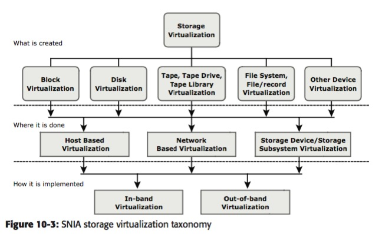

# 存储虚拟化
存储虚拟化到底什么目的呢? 
infrastructures越来越阻碍storage system develop
### 各种虚拟化
* mem 虚拟化 
* 网络虚拟化 
* server 虚拟化  抽象层->vm
* 存储虚拟化 很多种arch，技术

### SNIA 存储虚拟化术语
三层的虚拟化概念   what where how

### storage虚拟化配置
* in-band(所有的network访问都先到一个server， 由这个server来处理) 
* out-of-band(虚拟化网络是data path 和 control logic分离) tech. 

我感觉存储虚拟化就是，如何提供virtual visit to all storage resources in network

### 挑战
维持scalability, functionality, infrastructure 的 manageability， 以及兼容不同底层vendor techs 等
### 存储虚拟化的类型
* 为什么讨论了 SAN(block-level)/ NAS(file-level) 技术？  这两个技术的本质我还没分辨清楚
* SAN/ NAS 中的虚拟化分别解决了一些问题
* NAS file storages 不再是independent，host可以不绑定一个file storage

### 实战
我始终感觉SDN对 storage virtualization 应该有用
总体应该还就是 SAN 和 NAS两种 virtualized storage 

