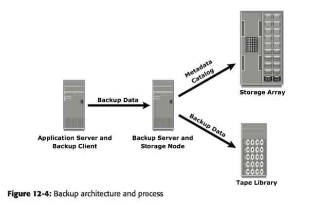
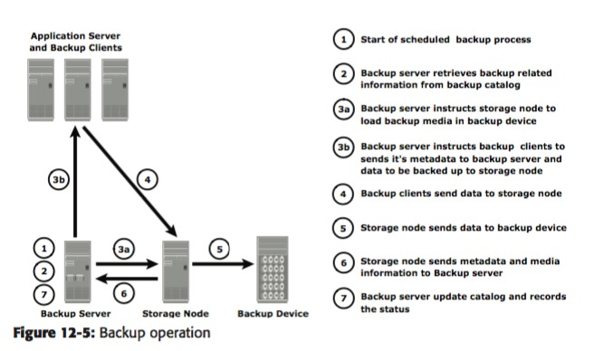
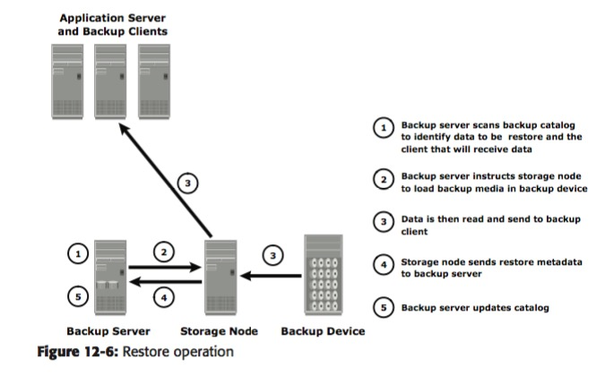
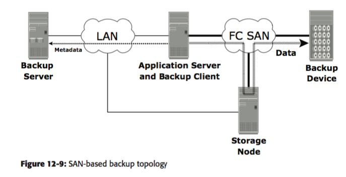

# Business Continuity in Storage System
### 介绍
为维护数据的可访问性而制定的business operations 

* Information Availability 
	* reliability/ accessibility/ timeliness(需要访问的时间段)
	* 有一些衡量数据
* BC 术语
RPO: 在恢复点要求能restore哪些数据，（当天的/ 一小时的/ zero(同步mirror)）
RTO: 指restore需要在多长的时间内完成（这也意味着不同的策略） 

* BC planning lifecycle
由restore目标开始design/ implement
* Failure Analysis 
	* 避免单点failure全局fail（a single point of failure） 需要 fault tolerance/ 多路复用也带来了性能上的好处
* 一些技术： backup/ 在local storage array中replicate data/ 在remote array上 replica/ host-based虚拟技术虚拟local or remote replica

主要就讲了需要fault tolerance 

### Backup and Recovery
* backup purpose:   
主要是disaster recovery/ 操作上的恢复（有点像log）/ archival 
* backup 考虑
各种因素
* backup 粒度
	* full/ cumulative/ incremental (后两种怎么说？)
	* incremental 定期full backup, 然后每次记录相比于上次的变化
	* 而cumulative则是每个点都记录相对于上次full backup的变化
	* synthetic full backup ? 
* recovery 考虑 
需要能从多远recover; recovery需要多长时间
* backup 方法 
	* hot backup/ cold backup  backup的时候是否还在active 访存
	* 简单等到cold再backup不现实（特别是OS中）
	* agents 
	* PIT copy 技术  不懂？ 
	* backup 也要backup file的attributes 
* backup 过程
	* metadata 和 data 是存到不同的device上的
	* 结构 
	
* backup & restore operations
	* backup server 很关键 data/ log 主要是这两个data的转移
	
	所以主要是 storage 和 backup 两级，但是哪些进入backup是由backup server决定的
	* restore 恢复数据也要update log（存在backup server中）    backup node的信息应该是存在storage node中
	

* backup 拓扑 
	* 三种backup： direct attached, LAN based, SAN based
	* direct attached: 只有log推到backup server, 否则直接connect到一个application server
	* LAN 就是application server, backup server, storage node, backup device 都用lan 连接
	* SAN 更优
	
 	* serverless 是怎么个概念？？？？   性不出local/ remote replication 还能做什么？ 
* ***backup in NAS***  三种methods   讲道理，这几个我都没怎么看懂
	* NDMP-2/3 有点特殊
* backup 技术
tape/ disks（更快）
virtual tape 用disk 模拟 tapes
* in practice
我是有点感觉 backup和storage 还是不一样，storage主要研究disk，storage可能disk，可能tape，并且存储的技术应该不一样
archive的出现是为了
### Local Replication   （应该不是只为了archive？）
也是为了维持BC，但是是在storage disk上，local表示在同一个array中replicas，remote表示在不同的disk array中

* source and target 
原始数据在source disk上，target disk上有备份。 然后， source和target都可能被updata，需要某种机制sync

* Local Replicas用途 
和back-up操作还是有区别，减少了back-up，

* Data Consistency
怎么跟database这么大关系？ 
这说的似乎是什么写 consistency，但是中心思想没太抓住

* Local Rep 技术
host-based/ storage-based rep 
	* host 由LVM或file system来发挥主要作用
		* logical volume/ phisical volume?   前者到后者 rep   I/O burden太高/ incremental resync??? 
		* file system snapshot   CoFW创建rep，有bitmap追踪change
	* storage array 就是在 array中将一些block备份
		* 全卷 mirroring 
		* pointer-based ？？？ 不知道讲了什么 

* 恢复 考虑
* 生成多份 replicas
* 管理接口
* 

### Remote Replication

## Reference  