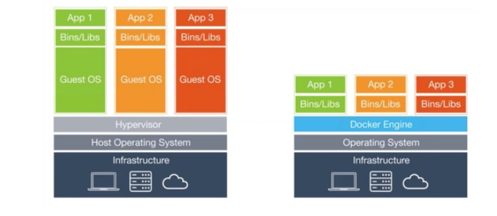

# Docker 
## What is a docker? 
什么是docker？ 什么又是container? 

* Docker 使用go开发
* 分为两大部分: 
	* 资源管理: cgroup->LXC(libcontainer)->Docker
		* 实现了对于file system, network等的分配/ 隔离
		* 所以container实际上是基于 guest OS kernel的一种vir tech.， 并没有去virtualize 某OS的实现
			* 每个运行的容器只是 host OS中的一个进程， 然后docker中的程序也是一个进程，只不过和父docker处在一个group中
			* 一个图片 
			
		* 为什么不直接用 cgroup? 
			如果对同一台服务上的少数应用需要控制资源的直接使用 cgroup 是较好的选择，可以按用户或用户组控制系统资源。如果服务需要指出多种环境，那么 Docker 就是最好的。
	* 镜像管理: AUFS
		* 在启动docker的时候，需要指定使用的镜像？ 跟这个有关系？ 
		* 所有container都是从imag 构建的 
#### 什么是container: 
* 没有OS vir所需的mem要求


#### 先看看什么是LXC
LXC是轻量级的虚拟化，基于linux内核的一些功能 

* cgroups  具体是什么还不清楚 
为特定的进程组限定可用的资源（实际就是共享了这些resources）
* 一个有关的 chroot的 system call ？？？？     
* 具体还是不知道 LXC 是怎么实现的

#### 为了增加 container的可移动性
docker 使用了 AUFS 技术


## Motivation？ 
增加share的东西, 其实是另一种idea，和hardw/ vir 不是一个思路
几个Blog: [1](https://zhuanlan.zhihu.com/p/19693311) [3](https://zhuanlan.zhihu.com/p/21104002)  [5](http://www.wenwenyun.com/a/tip/2014/0924/533.html)

#### 什么是 docker [1](https://www.docker.com/what-docker)
* docker 把一个app打包进一个container  （虽然我不知道这个 打包需要干哪些事情？）
* 一个很重要的 image的概念
* 和虚拟机比较: 主要就差在是否vir guest OS 
* 适合 distributed applications   scale 等  
（这个page的介绍怎么这么生涩！）   [很好的教程](https://docs.docker.com/engine/getstarted/step_six/)
* ***什么是docker images等***    
	* `docker run hello-world`  run 标示create并运行一个 docker container, hello-world表示应该用这个image导入container
	* **image** 本质是一个filesystem和一些runtime 参数
* 写Dockerfile
	* dockerfile  描述是什么软件被烧进这个image; 并且告诉软件，它运行的env，和需要执行的命令
	* From 标示，本image基于哪个image
	* RUN 运行一些命令（似乎是在host OS上运行）
	* CMD  这个还真不太知道是干什么的？
	* 我的第一个Dockerfile:
		```	
		FROM docker/whalesay:latest

		RUN apt-get -y update && apt-get install -y fortunes
		CMD /usr/games/fortune -a | cowsay
		``` 
* build image:
	* 命令: `docker build`
	* build 的过程 
		1. load From了的images
		2. 然后RUN
		3. 然后按CMD 启动等？  
* 从现有的image tag,push 到Docker hub 
	* 这个什么含义？ 给现有的image tag成一个新的副本，然后 push到hub上 
	* 然后可以通过 run 来pull 远程 rep 下的 image

## how to use it?   尝试 docker 
docker engine 本身就在linux distributions中 

* docker deamon ? docker cml interface? 
* `docker run hello-world`   实际上docker有一些images 在docker hub中
	* 通过这个命令的介绍，Docker CLI 和 Deamon 是这么运行的: 
		1. The Docker client contacted the Docker daemon.
 		2. The Docker daemon pulled the "hello-world" image from the Docker Hub.
 		3. The Docker daemon created a new container from that image which runs the executable that produces the output you are currently reading.
 		4. The Docker daemon streamed that output to the Docker client, which sent it to your terminal. 
 	* `docker run -it ubuntu bash`  似乎是可以运行ubuntu！！！！！！！！
* `docker ps -a` 可以看到所有的container 

#### 看几个例子
[参考网站](https://docs.docker.com/engine/tutorials/)

### 看第二个Blog  [2](https://zhuanlan.zhihu.com/p/20592511)
* 讲的很好: container 抽象了OS，而vm 抽象了硬件层
* 

## 看一下什么是 KVM？ 
[相关的paper](https://www.kernel.org/doc/ols/2007/ols2007v1-pages-225-230.pdf)

## Ref
两篇文章 from Remzi
[Oracle](http://www.oracle.com/technetwork/server-storage/solaris/documentation/consolidating-apps-163572.pdf) [Docker项目](http://delivery.acm.org/10.1145/2610000/2600241/11600.html?ip=202.38.93.97&id=2600241&acc=ACTIVE%20SERVICE&key=BF85BBA5741FDC6E%2EA4F9C023AC60E700%2E4D4702B0C3E38B35%2E4D4702B0C3E38B35&CFID=638174379&CFTOKEN=12615882&__acm__=1467295192_7d83bb7117b41948a568129b237d4abf)

[百度文库的一个介绍](http://yuedu.baidu.com/ebook/d817967416fc700abb68fca1?pn=1&rf=http%3A%2F%2Fyuedu.baidu.com%2Febook%2Fd817967416fc700abb68fca1)
[百度baike的介绍](http://baike.baidu.com/item/Docker)
