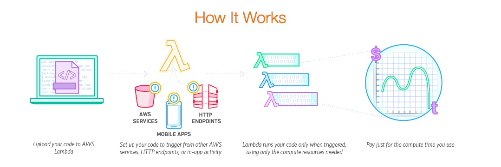

# Lambda Model 初窥
AWS Lambda 核心应该是 你只需要 upload code(针对不同event，调用不同function的code)，AWS帮你部署到servers上，并且scale

## service探索？ 
* 一个amazon自己很好的综述：

* 他和其他服务，eg DynamoDB ？？？的关联就在于： events可以是发生在DB中的，然后trigger code的执行（这些code是automatically configured和scaled的）
	* 换句话说， customer提供code(several functions)， 然后每个function 和 一个resource相关联（eg. db）, 然后当resource中发生event的时候，Lambda分配computing resource供customer跑functions
* 也可以做application的 back-end service， event由API触发， 或者Amazon API Gateway ？？？  
* lambda function 是无状态的？？？？ 所以它可以很方便地在servers中scale 
* 自动配置&scale computation resource， 可以通过CloudWatch 来 monitoring

## 工作机制探索？ 
#### AWS 自己的介绍
1. Event-Driven Compute
2. [参照这个](http://docs.aws.amazon.com/lambda/latest/dg/welcome.html)  大致的一个学习过程
	1. How it works [1](http://docs.aws.amazon.com/lambda/latest/dg/lambda-introduction.html)
	event作为parameter传给lambda function
	2. 上文中说的 example 
		1. 有一个 event source mapping 记录 event 和 functions的 对应关系
		2. custom application 使用 AWS SDK 调用 lambda functions  
3. 第一个尝试: [步骤](http://docs.aws.amazon.com/lambda/latest/dg/getting-started.html)
	1. 有AWS account， 还得创建一个 IAM console
	2. 设置好 IAM之后，用 username 在 account的这里登陆： https://414187120138.signin.aws.amazon.com/console/
	3. Setup AWS CLI     （Linx 下，使用pip安装）		`sudo pip install awscli`
	4. 配置 CLI [参考](http://docs.aws.amazon.com/cli/latest/userguide/cli-chap-getting-started.html)   使用 `aws configure`
	5. 写一个hello world function 
		1. AWS Lambda 会提供几个 blueprint 作为 example，让我们配置event source等 (这里采用了`hello-world-python` blueprint)
		2. 需要设置:
			1. runtime environment: Python 
			2. function code (申明各种events? 然后？  实际上是handler functions)
			3. function handler 
		3. 还能设置给funciton的内存空间等，预示function的运行情况
		4. 进行了一次根据给予events 数组的 test (出发了handler function的运行，然后输出了一个结果)
	6. 调用这个lambda function (目前还没有真正和别的source关联，由他们产生events)
4. 一些resources生成events的例子 ([参考网站](http://docs.aws.amazon.com/lambda/latest/dg/eventsources.html))
	1. JSON 真的有点看不懂
	2. 重点看一下 和 DynamoDB 的例子
		1. Stream-based model: event source mapping (有API 帮助 create mappings [API](http://docs.aws.amazon.com/lambda/latest/dg/API_CreateEventSourceMapping.html) )
		2. DynamoDB 会把 updates publish到stream中 记录  
		3. 这个例子的详细过程有一个 [tutorial](http://docs.aws.amazon.com/lambda/latest/dg/with-ddb-example.html)
5. Event Source Mapping [网页](http://docs.aws.amazon.com/lambda/latest/dg/intro-invocation-modes.html)
	1. Amzon Services 除了stream services like DynamoDB, mappings 存在source中   还有[权限的问题](http://docs.aws.amazon.com/lambda/latest/dg/intro-invocation-modes.html)
	2. DynamoDB 的mappings存在 Lambda中 
	3. custom app 不用mappings，直接invoke某个Lambda function 
6. Lambda Functions [参考](http://docs.aws.amazon.com/lambda/latest/dg/lambda-introduction-function.html)
	1. configure: 
		1. 可以指定想给function 分配多少mem
		2. timeout: function执行的上界
		3. Handler name: 指明code中开始执行的函数名 (产生events, 就会将events作为参数调用这个函数)
	2. invoke handlers， 有同步，异步之分，目前不知道区别？ 
	3. How does Lambda run my code?  The container model
		1. 每invoke一次function，startup a container 
		2. 一般container 会被重复使用
7. Lambda Handler: ([一个简单的文档](http://docs.aws.amazon.com/lambda/latest/dg/python-programming-model-handler-types.html))
	1. 需要定义一个handler 
	```
	def handler_name(event, context): 
    	...
    	return some_value
	```
		1. event: dict or list ... 表示events 
		2. context: LambdaContext 类型的  不知道能干什么？ 
		3. 可以return 一些values
	2.

#### Open Whisk
Open Whisk?  还有其他项目么？ 

## Open-lambda 设计思路探索 
## Ref
[AWS的Lambda首页](https://aws.amazon.com/lambda/)

