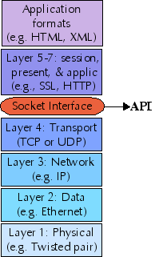

# TCP/IP Programming
抽象出来是: socket 编程 (socket是什么还是得思考一下？ )
注意socket所在的层次 

* 抽象: 主要是 TCP/UDP （但是都基于IP）
* socket 由machine address 和 port number name

## Socket 编程
* 本质上还是一个远程 process communication 机制的 abstraction  
	* socket的IP，协议，端口号 唯一标识了一个 process
	* 而对于一个proces， socket还是相当于file （特别是在UNIX中）
* bind: 
	* kernel虽然会在sendto的时候帮我们分配physical port, 但是如果你是一个server, 你还没发信息就需要监听了，这个时候就需要一个physical port
	* 使用bind 来分配一个 
	* [参考](http://www.cnblogs.com/nightwatcher/archive/2011/07/03/2096717.html)
* 设置阻塞，非阻塞 [参考](http://www.programgo.com/article/1125758595/)
## Ref
[一个很好的tutorial](http://gnosis.cx/publish/programming/sockets.html)
[一个解释](http://blog.csdn.net/dlutbrucezhang/article/details/8577810)