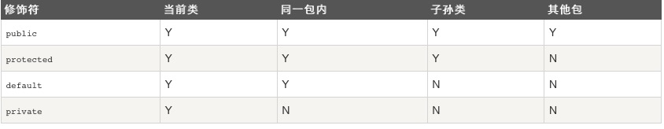

# Java

## Intro
* 所有的Java 程序由public static void main(String []args)方法开始执行。
    * args.length 表示长度
    * args 从0 开始是第一个argument
* java 修饰符
* 源文件
    * 只能一个public 类， 可多个非public类
    * package, import 概念

## Object
* 类
    * 变量:
        * 局部变量
        * 实例变量
            * 可以被修饰符 修饰 权限
        * 类变量：  static 声明的， 类级别定义，所有实例共享
            * 存在静态数据区
    * 构造方法和类名相同： 可以有多个（多态）
* 数据类型：
    *  long a = 100000L
    * boolean one = true  默认 false
    * 本质上也是类
    * instance 实际上是 引用类型（引用了那一段内存空间）  数组也是
    * 常量:
        *final double PI = 3.1415927;
* 访问控制修饰符

    * private: 只有类中方法可以访问
    * public: 任何其他类访问
    * protected: 同一包中可访问，子类可访问
    * default: 不加声明
    * 继承：
        * 父类中声明为public的方法在子类中也必须为public。
        * 父类中声明为protected的方法在子类中要么声明为protected，要么声明为public。不能声明为private。
        * 父类中声明为private的方法，不能够被继承。
* 非访问控制修饰符
    * Final， 类不能被继承，方法不能被修改，变量为常量
        * 但final 对象里面的数据可以改
    * Static 类方法和类变量  (类级别，所有实例共享)
    * Abstract 抽象类，抽象方法
        * 只是声明一下，后面扩充（子类）
    * Synchronized, volatile 线程编程
        * synchronized: 这个方法同时只能被一个线程访问
        * transient? 
        * volatile 修饰的变量， 每次被read，都从shared mem中check值； write会向shared mem 中写
* 一些常用的类
    * Number 类
        * 所有Integer 什么的都是Number的子类
        * 想调用方法就不能用 int了
        * Number提供了一些很好用的方法 [Number类](http://www.runoob.com/java/java-number.html)
    * Character 类
        * char 在这个类中 [也有一些好用的方法](http://www.runoob.com/java/java-character.html)
    * String 类
        * 不可改变的！  但是可以concat 返回一个新string这样 
        * .length()
        * .format() 可以组成格式化的字符串
    * StringBuffer StringBuilder 
        * 可改变？
        * 后者更快，但是前者线程安全
    * 一些时间，日期操作
        * [参考](http://www.runoob.com/java/java-date-time.html)
        * System.out.println(new Date());
        * Thread.sleep(1000*3);
* 数组：  datatype[]
    * 声明: 不指定长度
        * 数组对象表示的就是mem中那些element在一起的一个对象
        * datatype[] variable = new datatype[Size];  再动态赋值
        * datatype[] variable = {xxx,xxx};
    * 数组对象可以作为argument 和return
        * 但是本质上， 对象数组存储的只是Object的地址
        * 本质上， 对象只是一个对heap中区域的引用
* 正则表达式：
    * 搜索，编辑，处理文本
    * 不太懂！
* 方法：
    * 值传递？ 引用传递？
        * 基本类型肯定是按值传递
        * 对象（包括数组），是传递了那个对象的地址  [参考](http://6924918.blog.51cto.com/6914918/1283761)
    * 可变参数: `typeName... parameterName` （不知道有没有用...）
    * 可以用系统的 construction 方法，同时也可以写自己的finalize 方法 （在garbage collector 的时候工作）   
* JAVA IO  （没有尝试）
    * Stream 
    * Scanner 类
* JAVA 异常处理
    * Exception extends Throwable (还有一个是Error， 我们不考虑)
    * 包括: IOException / RuntimeException
    * try catch 捕获异常
    ``` java
     try{
    // 程序代码
    }catch(异常类型1 异常的变量名1){
        // 程序代码
    }catch(异常类型2 异常的变量名2){
        // 程序代码
    }catch(异常类型2 异常的变量名2){
        // 程序代码
    } finally {
        // 无论如何都要执行的代码
    }
    ```
* 可以自己extends Exception 类来定义异常类
    * 用来检查等
    * `e.printStackTrace()` 也常用 
* 继承
    * extends 继承父类  implements 实现interface
        * 只能单继承父类
        * 但是可以多继承接口
        * 可以包含别的类  has a
    * overwrite 和 override
        * overwrite 父类方法， 但是形参和返回值不能变 
        * 在重写的时候还可以调旧的方法，用`super(name, address, number);` 调用 
        * 可以有参数不相同，相同名字的方法
    * 父类，子类可以相互转型，但是不能通过父类引用引用子类才有的方法
        * 因为编译通不过
        * 但是运行的时候还是要抓住 引用-> heap中instance这个根本
        * 哪怕是 `父类 tmp = new 子类（）` 最后还是调用的子类中重写了的那个方法
    * 可以有abstract class， 其中也可以有abstract method
        * 子类继承的时候实现
    * interface 抽象方法的集合， implements
        * 标记接口？
* Package:  
组织类, 同一个package中不能有相同name的class，但是不同package种可以
    * 在第一行声明属于那个 package， 然后将class们放到这个package名的dir下
    * 编译class的时候，实际就会按package的路径名重新命名class

## 高级
* JAVA 有一些数据结构类
* JAVA 有泛型的概念 (方法和对象可以有不定的类型变量)
* Java 可以把object 序列化和 deserialized to/from file
* 多线程：    [多线程](http://www.runoob.com/java/java-multithreading.html)
    * 通过 implement runnable 
    * 通过 extend Thread      

## Jar 
* 本质上应该只是一个 package的压缩版本 [一个讲解](http://www.cnblogs.com/haolujun/archive/2013/03/02/2939698.html)

## Netbeans 安装
* [很好的一个参考](http://www.wikihow.com/Install-Netbeans-on-a-Linux)
* 也需要安装相应的JDK， 去到netbeans/etc 中找 netbeans.conf, 修改netbeans_jdkhome, eg "/usr/lib/jvm/java-9-oracle/"

## JVM 
[挺好的一篇文章](http://www.360doc.com/content/10/1125/19/4154133_72389630.shtml)
## Ref

