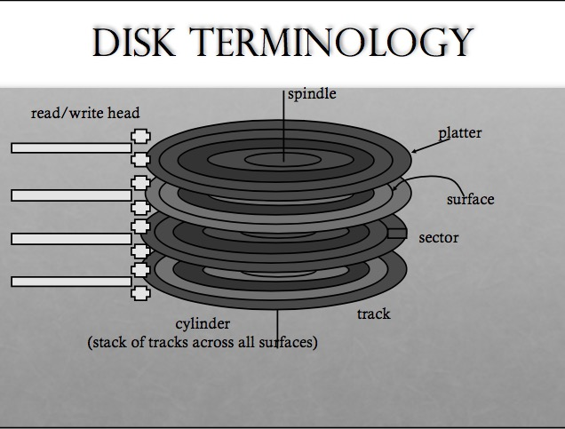

# I/O Introduction
### Architecture
Because of cost, hierarchical bus lines

* general IO Bus:  PCI
* Peripheral IO: SCSI, SATA, USB 

### Device
Two parts:

* Interface to be controlled
    * three registers: status, command, data
* Internal: cpu, mem etc

### Protocol
How to interact and control I/O device

* status: check device status (wait until not busy)
* write data to data register
* write command to let device do something
* 然后 还需要等待 写完的意思

### Interrupts vs Polling
From blocking to unblocked

* need to wait -> sleeping
* status changed -> raise interrupts
* handler(get the status)/ set the process runnable

对比选择 polling or interrupts

* fast I/O 还是用 polling
* flood of interrupts 会导致 livelock (只能处理interrupts)
* 可以hybrid做，或者合并interrupts

### DMA 和 Programmed IO
大规模I/O

* OS 设置 DMA
* DMA帮我们I/O
* 完成了 interrupt

### Methods of Device Interaction
两种

* 直接的操控I/O 设备的指令 （port）
* mem-mapped I/O  (将register映射成mem中的地址)
* file system 为例： driver提供block级别操作抽象给file system, 然后file system 提供POSIX操作给application
    * file system 和 driver之间会有 IO scheduler
        * order Block IO
    * 
        
### Hard Disk
* Interface
    * read/ write
    * sectors (连续的array, block): 512/ 4096 Bytes
* Internal
    
* Positioning 的过程
    * servo burst 帮助head 知道它在哪
    * seek track -> wait for rotation -> transfer data
* 读写时间计算
    * seek + rotation + transfer time
    * 不好确定（平均seek distance: 1/3 max seek distance） + RPM * Average rotation(1/2) + 512 bytes/ bandwidth 
* Seq vs Random throughput 
    * seq 忽略两个时间
* 其他技术：
    * track skew  track上sector的编号要注意 enough time for head to settle down
    * Zoned bit recording  more sectors on outer tracks
    * Drive cache
        * 在rotation 的时候将entire track 读进来
        * buffering writes

